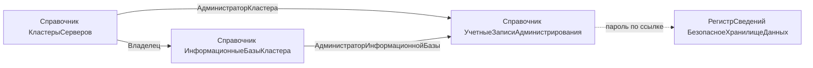

# Структура хранения настроек RAS в конфигурации «Вышибала»

## На чём основано

В конфигурации уже есть подсистема БСП «Администрирование кластера». RAS-ветка (`АдминистрированиеКластераRAS`) в этой версии использует `Новый АдминистрированиеСервера(адрес, порт)`, а не `rac.exe`. Путь к утилите не храним.

Константа БСП `ПараметрыАдминистрированияИБ` — это настройки **текущей** ИБ, не каталог чужих баз. Её не используем.

Хранилище проектируется под два конструктора:

- `АдминистрированиеКластера.ПараметрыАдминистрированияКластера()` — `ТипПодключения`, `АдресСервераАдминистрирования`, `ПортСервераАдминистрирования`, `ПортКластера`, `ИмяАдминистратораКластера`, `ПарольАдминистратораКластера`.
- `АдминистрированиеКластера.ПараметрыАдминистрированияИнформационнойБазыКластера()` — `ИмяВКластере`, `ИмяАдминистратораИнформационнойБазы`, `ПарольАдминистратораИнформационнойБазы`.

Следствия:

- Кластер ищется по порту внутри одного RAS. `ПортКластера` обязателен, UUID кластера не храним.
- Администраторы агента не нужны: `АгентСервера()` без аутентификации. Нужны администратор кластера и администратор ИБ. Админ ИБ требуется уже для чтения сеансов, не только для блокировки. Пустая ссылка на учётку = пустые имя и пароль (список администраторов не задан).

Ограничение выбранной модели «два справочника»: адрес и порт RAS дублируются в каждом кластере одного RAS. Это принято сознательно.

## Состав объектов



Это первые собственные справочники конфигурации (остальные — БСП). В `СтандартныеПодсистемы` их не включать.

### Справочник `УчетныеЗаписиАдминистрирования`

- `Наименование` (150) — «Админ кластера ПРОД».
- `ИмяПользователя` — Строка (64).
- `Комментарий` — Строка неограниченная.
- Пароль не реквизит. `ОбщегоНазначения.ЗаписатьДанныеВБезопасноеХранилище(Ссылка, Пароль, "Пароль")`. Измерение `Владелец` регистра уже принимает любой `CatalogRef`.
- В `ПередУдалением` — `ОбщегоНазначения.УдалитьДанныеИзБезопасногоХранилища(Ссылка)` в привилегированном режиме.
- История данных не включать: пароль в реквизитах нет, но копирование элемента пароль не копирует — это ожидаемо.
- Различать «учётка кластера / учётка ИБ» не нужно: в API это одна и та же пара имя+пароль.

### Справочник `КластерыСерверов`

- `Наименование` (150).
- `АдресСервераАдминистрирования` — Строка (255), обязательный (100 мало для FQDN/IPv6).
- `ПортСервераАдминистрирования` — Число (5,0), заполнение 1545, проверка 1–65535.
- `ПортКластера` — Число (5,0), заполнение 1541, проверка 1–65535.
- `АдминистраторКластера` — ссылка на учётную запись, не обязательный.
- `Комментарий`.
- Дубли тройки адрес + порт RAS + порт кластера — в `ОбработкаПроверкиЗаполнения` запросом с исключением текущей ссылки.

### Справочник `ИнформационныеБазыКластера`, подчинён `КластерыСерверов`

Имя `ИнформационныеБазы` слишком общее для первого собственного справочника; программное имя должно явно указывать на кластер.

- Владелец — `КластерыСерверов`, проверка заполнения.
- `Наименование` (150).
- `ИмяВКластере` — Строка (128), обязательный.
- `АдминистраторИнформационнойБазы` — ссылка на учётную запись, не обязательный.
- `Комментарий`.
- Уникальность владелец + `ИмяВКластере` в `ОбработкаПроверкиЗаполнения`.

### Формы

Формы списка и элемента у всех трёх. Код — стандартный автономер (длина по умолчанию), выводить в списке и карточке. Длину кода 0 не ставить. Уникальность по-прежнему на прикладных полях, не на коде.

Форма учётной записи по образцу БСП (`УчетныеЗаписиЭлектроннойПочты`):

- реквизит формы `Пароль` с `РежимПароля`, флаг «пароль изменён»;
- при открытии **не** читать сам пароль на клиент, только признак «пароль задан»;
- запись и очистка — серверным вызовом после записи ссылки;
- кнопка «Очистить пароль».

В формах кластера и базы — команда «Проверить подключение».

### Подсистема и права

- Корневая подсистема командного интерфейса `УправлениеСеансами` (отдельный раздел, не дочерняя от `Администрирование`).
- В состав — три справочника.
- Отдельные роли **не создавать** в этом шаге: у `ПолныеПрава` уже `Set rights for new objects = true`. Отдельные роли имеют смысл позже, вместе с профилями `УправлениеДоступом`.
- Интерактивных прав на `БезопасноеХранилищеДанных` пользователям не давать: доступ только через привилегированный режим в своём коде.

## Общий модуль-мост

`НастройкиАдминистрированияКластеров` — серверный, **не** привилегированный целиком. В 1С привилегированность задаётся на модуль, а не на метод; привилегированный модуль обошёл бы права на проверке подключения.

Чтение пароля — локально:

```bsl
УстановитьПривилегированныйРежим(Истина);
Пароль = ОбщегоНазначения.ПрочитатьДанныеИзБезопасногоХранилища(УчетнаяЗапись);
УстановитьПривилегированныйРежим(Ложь);
```

Реквизиты кластера и базы читать через `ОбщегоНазначения.ЗначенияРеквизитовОбъекта`, не через точку от ссылки.

Экспорт:

- `ПараметрыАдминистрированияКластера(Кластер)` — `ТипПодключения = "RAS"`.
- `ПараметрыАдминистрированияИнформационнойБазы(ИнформационнаяБаза)`.
- `ПроверитьПодключение(ИнформационнаяБаза)` / по кластеру — `АдминистрированиеКластера.ПроверитьПараметрыАдминистрирования`.

Загрузку списка баз из кластера (`СвойстваИнформационныхБаз`) **не делать в этом шаге**: это уже прикладная команда, не структура хранения. Хватит проверки подключения.

Код серверный. БСП сама запрещает администрирование в безопасном режиме и в модели сервиса.

## Порядок работ

Создавать через EDT-MCP (`create_metadata` / `modify_metadata`), без правки `.mdo` вручную. Сначала учётные записи (на них ссылаются), затем кластеры, затем базы. После каждого блока — `get_project_errors` по затронутым объектам.
